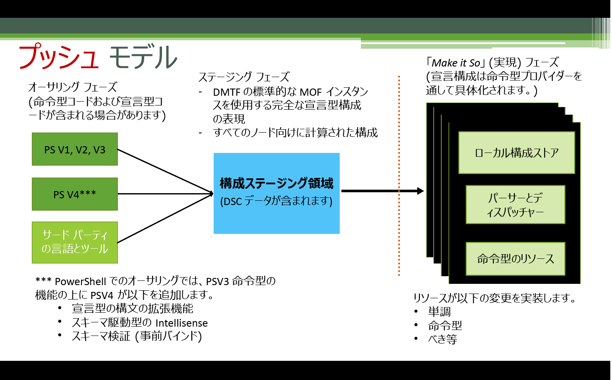
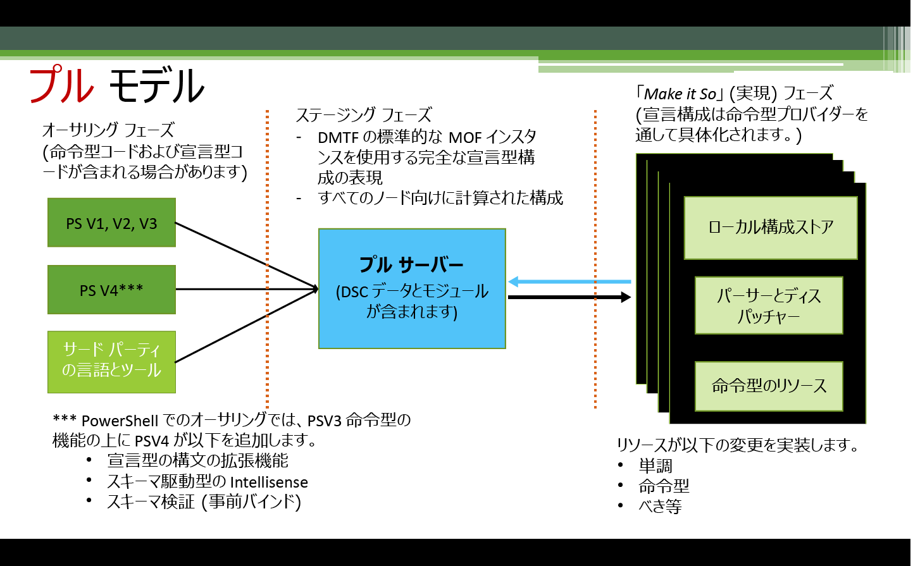

# 構成の適用

>適用先: Windows PowerShell 4.0、Windows PowerShell 5.0

PowerShell Desired State Configuration (DSC) 構成を適用するには、プッシュ モードとプル モードの 2 つの方法があります。

## プッシュ モード

プッシュ モードは、[Start-DscConfiguration](https://technet.microsoft.com/en-us/library/dn521623.aspx) コマンドレットを呼び出してターゲット ノードに構成を適用するユーザー アクティビティを示します。

構成を作成し、コンパイルした後、プッシュ モードで適用するには、[Start-DscConfiguration](https://technet.microsoft.com/en-us/library/dn521623.aspx) コマンドレットを呼び出し、コマンドレットの -Path パラメーターを構成 MOF が配置されているパスに設定します。 たとえば、構成 MOF が `C:\DSC\Configurations\localhost.mof` にある場合は、`Start-DscConfiguration -Path 'C:\DSC\Configurations'` というコマンドを使用してローカル コンピューターに適用します。

> __注__: 既定では、DSC はバックグラウンド ジョブとして構成を実行します。 構成を対話的に実行するには、__-Wait__ パラメーターを指定して [Start-DscConfiguration](https://technet.microsoft.com/library/dn521623.aspx) を呼び出します。

## プル モード

プル モードでは、プル クライアントはリモート プル サーバーから Desired State Configuration を取得するように構成されます。 同様に、プル サーバーは、DSC サービスをホストするようにセットアップされ、プル クライアントに必要な構成とリソースを使用してプロビジョニングされています。 それぞれのプル クライアントには、ノードの構成に対して定期的なコンプライアンス チェックを実行するタスクがスケジュールされています。 イベントが最初にトリガーされたとき、プル クライアント上のローカル構成マネージャー (LCM) によって、LCM で指定された構成を取得するためのプル サーバーへの要求が行われます。 プル サーバーにその構成が存在し、最初の検証チェックに合格した場合、構成はプル クライアントに送信され、LCM によって実行されます。

LCM はクライアントが構成に準拠しているかどうかを、LCM の **ConfigurationModeFrequencyMins** プロパティで指定された間隔で定期的にチェックします。 LCM はプル サーバーで更新された構成を、LCM の **RefreshModeFrequency** プロパティで指定された間隔で定期的にチェックします。 LCM の構成の詳細については、「[ローカル構成マネージャーの構成](metaConfig.md)」を参照してください。

DSC プル サーバーのセットアップについては、「[DSC Web プル サーバーのセットアップ](pullServer.md)」を参照してください。

オンライン サービスを利用してプル サーバー機能をホストする場合は、「[Azure Automation DSC の概要](https://azure.microsoft.com/en-us/documentation/articles/automation-dsc-overview/)」を参照してください。

次のトピックでは、プル サーバーとクライアントをセットアップする方法について説明します。

- [Setting up a web pull server (Web プル サーバーのセットアップ)](pullServer.md)
- [Setting up an SMB pull server (SMB プル サーバーのセットアップ)](pullServerSMB.md)
- [Configuring a pull client (プル クライアントの構成)](pullClientConfigID.md)

