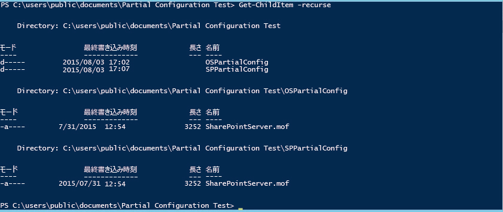
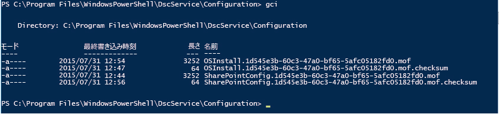

# PowerShell Desired State Configuration の部分構成

>適用先: Windows PowerShell 5.0

PowerShell 5.0 では、Desired State Configuration (DSC) によって、複数のソースからフラグメントで構成を配信できます。 ターゲット ノード上のローカル構成マネージャー (LCM) によって、フラグメントがまとめられ、1 つの構成として適用されます。 この機能により、チームまたは個人間で構成の制御を共有できます。 たとえば、2 つ以上開発者のチームがサービスで共同作業を行っている場合、それぞれがサービスの自身の一部を管理する構成を作成する可能性があります。 これらの構成は、それぞれ異なるプル サーバーからプルされ、開発の異なる段階で追加される可能性があります。 部分構成では、1 つの構成ドキュメントの編集を調整することなく、さまざまな個人またはチームが構成ノードのさまざまな側面を制御することもできます。 たとえば、1 つのチームが VM とオペレーティング システムの展開を担当し、別のチームがその VM に別のアプリケーションとサービスを展開する場合があります。 部分構成を使用すると、各チームが、不必要に複雑になることなく、独自の構成を作成できます。

プッシュ モード、プル モード、または 2 つの組み合わせで部分構成を使用することができます。

## プッシュ モードでの部分構成
部分構成をプッシュ モードで使用するには、ターゲット ノードで、部分構成を受信する LCM を構成します。 各部分構成は、Publish-DSCConfiguration cmdlet を使用して、ターゲットにプッシュされる必要があります。 その後、ターゲット ノードによって、部分構成が 1 つの構成に結合されます。また、[Start-DscConfiguration](https://technet.microsoft.com/en-us/library/dn521623.aspx) コマンドレットを呼び出して、構成を適用することができます。

### プッシュ モードの部分構成用の LCM の構成
プッシュ モードの部分構成用の LCM を構成するには、各部分構成に 1 つの **PartialConfiguration** ブロックを使用して **DSCLocalConfigurationManager** 構成を作成します。 LCM の構成の詳細については、「[ローカル構成マネージャーの構成](https://technet.microsoft.com/en-us/library/mt421188.aspx)」をご覧ください。 次の例では、OS を展開する部分構成と SharePoint を展開および構成する部分構成の 2 つの部分構成が必要な LCM 構成を示しています。

```powershell
[DSCLocalConfigurationManager()]
configuration PartialConfigDemo
{
    Node localhost
    {
        
           PartialConfiguration OSInstall
        {
            Description = 'Configuration for the Base OS'
            RefreshMode = 'Push'
        }
           PartialConfiguration SharePointConfig
        {
            Description = 'Configuration for the SharePoint server'
            RefreshMode = 'Push'
        }
    }
}
PartialConfigDemo 
```

各部分構成の **RefreshMode** は、"Push" に設定されています。 **PartialConfiguration** ブロックの名前 (この例では "OSInstall" と "SharePointConfig") はターゲット ノードにプッシュされる構成の名前と正確に一致する必要があります。

### プッシュ モードの部分構成の公開および開始


次に構成ごとに **Publish-DSCConfiguration** を呼び出して、構成ドキュメントを含むフォルダーを Path パラメーターとして渡します。 両方の構成の発行後に、ターゲット ノードで `Start-DSCConfiguration –UseExisting` を呼び出すことができます。

## プル モードでの部分構成

部分構成は、1 つ以上のプル サーバーからプルできます。プル サーバーの詳細については、「[DSC Web プル サーバーのセットアップ](pullServer.md)」をご覧ください。 これを行うには、ターゲット ノードで、部分構成をプルし、プル サーバーで構成ドキュメントを適切に名前付けおよび配置する LCM を構成する必要があります。

### プル ノード構成用の LCM の構成

プル サーバーから部分構成をプルする LCM を構成するには、**ConfigurationRepositoryWeb** (HTTP プル サーバーの場合) ブロックまたは **ConfigurationRepositoryShare** (SMB プル サーバーの場合) ブロックのいずれかでプル サーバーを定義します。 その後、**ConfigurationSource** プロパティを使用して、プル サーバーを参照する **PartialConfiguration** ブロックを作成します。 また、LCM がプル モードを使用することを指定する Settings ブロックを作成し、プル サーバーとターゲット ノードで構成の識別に使用される ConfigurationID を指定する必要があります。 次のメタ構成では、CONTOSO-PullSrv という HTTP プル サーバーとこのプル サーバーを使用する 2 つの部分構成が定義されています。

```powershell
[DSCLocalConfigurationManager()]
configuration PartialConfigDemo
{
    Node localhost
    {
        Settings
        {
            RefreshMode = 'Pull'
            ConfigurationID = '1d545e3b-60c3-47a0-bf65-5afc05182fd0'
            RefreshFrequencyMins = 30 
            RebootNodeIfNeeded = $true
        }
        ConfigurationRepositoryWeb CONTOSO-PullSrv
        {
            ServerURL = 'https://CONTOSO-PullSrv:8080/PSDSCPullServer.svc'
            
        }
        
           PartialConfiguration OSInstall
        {
            Description = 'Configuration for the Base OS'
            ConfigurationSource = '[ConfigurationRepositoryWeb]CONTOSO-PullSrv'
            RefreshMode = 'Pull'
        }
           PartialConfiguration SharePointConfig
        {
            Description = 'Configuration for the Sharepoint Server'
            ConfigurationSource = '[ConfigurationRepositoryWeb]CONTOSO-PullSrv'
            DependsOn = [PartialConfiguration]OSInstall
            RefreshMode = 'Pull'
        }
    }
}
PartialConfigDemo 
```

複数のプル サーバーから部分構成をプルすることができます。このためには、各プル サーバーを定義し、各 PartialConfiguration ブロックで適切なプル サーバーを参照することのみが必要となります。

メタ構成を作成したら、それを実行して構成ドキュメント (MOF ファイル) を作成し、[Set-DscLocalConfigurationManager](https://technet.microsoft.com/en-us/library/dn521621(v=wps.630).aspx) を呼び出して LCM を構成する必要があります。

### プル サーバーでの構成ドキュメントの名前付けおよび配置

部分構成ドキュメントは、プル サーバーの `web.config` ファイルで **ConfigurationPath** として指定されたフォルダーに配置する必要があります (通常 `C:\Program Files\WindowsPowerShell\DscService\Configuration`)。 構成ドキュメントは次のように名前を付ける必要があります。_ConfigurationName_。 _ConfigurationID_`.mof`。ここで _ConfigurationName_ は部分構成の名前であり、_ConfigurationID_ はターゲット ノードの LCM で定義されている構成 ID です。 この例では、構成ドキュメントの名前は次のようになります。


### プル サーバーからの部分構成の実行

ターゲット ノードで LCM を構成し、プル サーバーで構成ドキュメントを作成して適切に名前を付けた後に、ターゲット ノードによって、部分構成がプルされ、それらが結合されて、LCM の **RefreshFrequencyMins** プロパティによって指定されているように定期的に結果の構成が適用されます。 強制的に更新する場合は、Update-DscConfiguration コマンドレットを呼び出して、構成をプルし、`Start-DSCConfiguration –UseExisting` を呼び出して、その構成を適用することができます。

## プッシュとプルの混在モードでの部分構成

部分構成のプッシュ モードとプル モードを混在させることができます。 つまり、プル サーバーからプルされた部分構成とプッシュされた別の部分構成を持つことができます。 それぞれの部分構成は、前のセクションで説明したように、更新モードに応じて扱います。 たとえば、次のメタ構成では、プル モードのオペレーティング システムの部分構成とプッシュ モードの SharePoint 部分構成がある同じ例が記述されています。

```powershell
[DSCLocalConfigurationManager()]
configuration PartialConfigDemo
{
    Node localhost
    {
        Settings
        {
            RefreshMode = 'Pull'
            ConfigurationID = '1d545e3b-60c3-47a0-bf65-5afc05182fd0'
            RefreshFrequencyMins = 30 
            RebootNodeIfNeeded = $true
        }
        ConfigurationRepositoryWeb CONTOSO-PullSrv
        {
            ServerURL = 'https://CONTOSO-PullSrv:8080/PSDSCPullServer.svc'
            
        }
        
           PartialConfiguration OSInstall
        {
            Description = 'Configuration for the Base OS'
            ConfigurationSource = '[ConfigurationRepositoryWeb]CONTOSO-PullSrv'
            RefreshMode = 'Pull'
        }
           PartialConfiguration SharePointConfig
        {
            Description = 'Configuration for the Sharepoint Server'
            DependsOn = [PartialConfiguration]OSInstall
            RefreshMode = 'Push'
        }
    }
}
PartialConfigDemo 
```

なお、Settings ブロックで指定されている **RefreshMode** は "Pull" ですが、OSInstall 部分構成の **RefreshMode** は "Push" です。

それぞれの更新モードの前述の説明に従って、構成ドキュメントの名前付けおよび配置を行います。 **Publish-DSCConfiguration** を呼び出して、SharePointInstall 部分構成を公開し、OSInstall 構成がプル サーバーからプルされることを待機するか、または [Update-DscConfiguration](https://technet.microsoft.com/en-us/library/mt143541(v=wps.630).aspx) を呼び出して強制的に更新します。

##参照 

**概念**
[Windows PowerShell Desired State Configuration プル サーバー](pullServer.md) 
[ローカル構成マネージャーの構成](https://technet.microsoft.com/en-us/library/mt421188.aspx) 


<!--HONumber=Mar16_HO4-->


