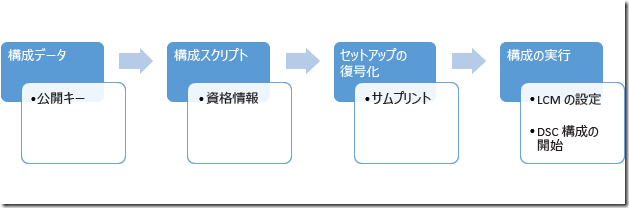

# <a name="securing-the-mof-file"></a><span data-ttu-id="951ab-103">MOF ファイルのセキュリティ保護</span><span class="sxs-lookup"><span data-stu-id="951ab-103">Securing the MOF File</span></span>

><span data-ttu-id="951ab-104">適用先: Windows PowerShell 4.0、Windows PowerShell 5.0</span><span class="sxs-lookup"><span data-stu-id="951ab-104">Applies To: Windows PowerShell 4.0, Windows PowerShell 5.0</span></span>

<span data-ttu-id="951ab-105">DSC は、どのような構成が必要であるかをターゲット ノードに指示するために、その情報が含まれた MOF ファイルを各ノードに送信します。各ノードでは、ローカル構成マネージャー (LCM) によって、必要な構成が実装されます。</span><span class="sxs-lookup"><span data-stu-id="951ab-105">DSC tells the target nodes what configuration they should have by sending a MOF file with that information to each node, where the Local Configuration Manager (LCM) implements the desired configuration.</span></span> <span data-ttu-id="951ab-106">このファイルには構成の詳細が含まれているため、安全に保つことが重要です。</span><span class="sxs-lookup"><span data-stu-id="951ab-106">Because this file contains the details of the configuration, it’s important to keep it secure.</span></span> <span data-ttu-id="951ab-107">そのために、ユーザーの資格情報を確認するよう LCM を設定することができます。</span><span class="sxs-lookup"><span data-stu-id="951ab-107">To do this, you can set the LCM to check the credentials of a user.</span></span> <span data-ttu-id="951ab-108">このトピックでは、それらの資格情報を証明書で暗号化してターゲット ノードに安全に送信する方法について説明します。</span><span class="sxs-lookup"><span data-stu-id="951ab-108">This topic describes how to transmit those credentials securely to the target node by encrypting them with certificates.</span></span>

><span data-ttu-id="951ab-109">**注:** このトピックでは、暗号化に使用する証明書について説明します。</span><span class="sxs-lookup"><span data-stu-id="951ab-109">**Note:** This topic discusses certificates used for encryption.</span></span> <span data-ttu-id="951ab-110">暗号化には、自己署名証明書で十分です。秘密キーは常に秘密に保たれますし、暗号化はドキュメントの信頼性を意味しないからです。</span><span class="sxs-lookup"><span data-stu-id="951ab-110">For encryption, a self-signed certificate is sufficient, because the private key is always kept secret and encryption does not imply trust of the document.</span></span> <span data-ttu-id="951ab-111">認証の目的では、自己署名証明書を使用*しないでください*。</span><span class="sxs-lookup"><span data-stu-id="951ab-111">Self-signed certificates should *not* be used for authentication purposes.</span></span> <span data-ttu-id="951ab-112">認証の目的では、常に信頼された証明機関 (CA) からの証明書を使用する必要があります。</span><span class="sxs-lookup"><span data-stu-id="951ab-112">You should use a certificate from a trusted Certification Authority (CA) for any authentication purposes.</span></span>

## <a name="prerequisites"></a><span data-ttu-id="951ab-113">前提条件</span><span class="sxs-lookup"><span data-stu-id="951ab-113">Prerequisites</span></span>

<span data-ttu-id="951ab-114">DSC 構成のセキュリティ保護に使用される資格情報を正常に暗号化するには、次のものが必要になります。</span><span class="sxs-lookup"><span data-stu-id="951ab-114">To successfully encrypt the credentials used to secure a DSC configuration, make sure you have the following:</span></span>

* <span data-ttu-id="951ab-115">**証明書を発行して配布するための手段**。</span><span class="sxs-lookup"><span data-stu-id="951ab-115">**Some means of issuing and distributing certificates**.</span></span> <span data-ttu-id="951ab-116">このトピックとその例では、Active Directory 証明機関を使用することを前提としています。</span><span class="sxs-lookup"><span data-stu-id="951ab-116">This topic and its examples assume you are using Active Directory Certification Authority.</span></span> <span data-ttu-id="951ab-117">Active Directory 証明書サービスの背景情報の詳細については、「[Active Directory 証明書サービスの概要](https://technet.microsoft.com/library/hh831740.aspx)」と「[Active Directory 証明書サービス](https://technet.microsoft.com/windowsserver/dd448615.aspx)」を参照してください。</span><span class="sxs-lookup"><span data-stu-id="951ab-117">For more background information on Active Directory Certificate Services, see [Active Directory Certificate Services Overview](https://technet.microsoft.com/library/hh831740.aspx) and [Active Directory Certificate Services in Windows Server 2008](https://technet.microsoft.com/windowsserver/dd448615.aspx).</span></span>
* <span data-ttu-id="951ab-118">**ターゲット ノードへの管理アクセス**。</span><span class="sxs-lookup"><span data-stu-id="951ab-118">**Administrative access to the target node or nodes**.</span></span>
* <span data-ttu-id="951ab-119">**各ターゲット ノードでは、暗号化可能な証明書がそれぞれの個人用ストアに保存されています**。</span><span class="sxs-lookup"><span data-stu-id="951ab-119">**Each target node has an encryption-capable certificate saved its Personal Store**.</span></span> <span data-ttu-id="951ab-120">Windows PowerShell では、ストアへのパスは Cert:\LocalMachine\My です。</span><span class="sxs-lookup"><span data-stu-id="951ab-120">In Windows PowerShell, the path to the store is Cert:\LocalMachine\My.</span></span> <span data-ttu-id="951ab-121">このトピックの例では、"ワークステーション認証" テンプレートを使用します。このテンプレートは、その他の証明書テンプレートと共に、[[既定の証明書テンプレート]](https://technet.microsoft.com/library/cc740061(v=WS.10).aspx) にあります。</span><span class="sxs-lookup"><span data-stu-id="951ab-121">The examples in this topic use the “workstation authentication” template, which you can find (along with other certificate templates) at [Default Certificate Templates](https://technet.microsoft.com/library/cc740061(v=WS.10).aspx).</span></span>
* <span data-ttu-id="951ab-122">ターゲット ノード以外のコンピューターでこの構成を実行する場合は、**証明書の公開キーをエクスポート**して、構成の実行元であるコンピューターにインポートします。</span><span class="sxs-lookup"><span data-stu-id="951ab-122">If you will be running this configuration on a computer other than the target node, **export the public key of the certificate**, and then import it to the computer you will run the configuration from.</span></span> <span data-ttu-id="951ab-123">**公開**キーのみをエクスポートし、秘密キーは安全に保護してください。</span><span class="sxs-lookup"><span data-stu-id="951ab-123">Make sure that you export only the **public** key; keep the private key secure.</span></span>

## <a name="overall-process"></a><span data-ttu-id="951ab-124">全体的なプロセス</span><span class="sxs-lookup"><span data-stu-id="951ab-124">Overall process</span></span>

 1. <span data-ttu-id="951ab-125">ターゲット ノードごとに証明書のコピーが保持され、構成コンピューターに公開キーと拇印が保持されるように、証明書、キー、および拇印をセットアップします。</span><span class="sxs-lookup"><span data-stu-id="951ab-125">Set up the certificates, keys, and thumbprints, making sure that each target node has copies of the certificate and the configuration computer has the public key and thumbprint.</span></span>
 2. <span data-ttu-id="951ab-126">公開キーのパスと拇印が含まれた構成データ ブロックを作成します。</span><span class="sxs-lookup"><span data-stu-id="951ab-126">Create a configuration data block that contains the path and thumbprint of the public key.</span></span>
 3. <span data-ttu-id="951ab-127">ターゲット ノードに必要な構成を定義し、ターゲット ノードで暗号化の解除をセットアップする構成スクリプトを作成します。暗号化の解除は、証明書とその拇印を使用して構成データを解読するように、ローカル構成マネージャーに指示することによって行います。</span><span class="sxs-lookup"><span data-stu-id="951ab-127">Create a configuration script that defines your desired configuration for the target node and sets up decryption on the target nodes by commanding the Local Configuration manager to decrypt the configuration data using the certificate and its thumbprint.</span></span>
 4. <span data-ttu-id="951ab-128">構成を実行すると、ローカル構成マネージャーの設定が行われ、DSC 構成が起動します。</span><span class="sxs-lookup"><span data-stu-id="951ab-128">Run the configuration, which will set the Local Configuration Manager settings and start the DSC configuration.</span></span>



## <a name="certificate-requirements"></a><span data-ttu-id="951ab-130">証明書の要件</span><span class="sxs-lookup"><span data-stu-id="951ab-130">Certificate Requirements</span></span>

<span data-ttu-id="951ab-131">資格情報の暗号化を指定するには、公開キー証明書が、DSC 構成の作成に使用されているコンピューターから**信頼された**_ターゲット ノード_で使用可能である必要があります。</span><span class="sxs-lookup"><span data-stu-id="951ab-131">To enact credential encryption, a public key certificate must be available on the _Target Node_ that is **trusted** by the computer being used to author the DSC configuration.</span></span>
<span data-ttu-id="951ab-132">この公開キー証明書を DSC 資格情報の暗号化に使うには、満たす必要のある特定の要件があります。</span><span class="sxs-lookup"><span data-stu-id="951ab-132">This public key certificate has specific requirements for it to be used for DSC credential encryption:</span></span>
 1. <span data-ttu-id="951ab-133">**キー使用法**:</span><span class="sxs-lookup"><span data-stu-id="951ab-133">**Key Usage**:</span></span>
   - <span data-ttu-id="951ab-134">含める必要がある: 'KeyEncipherment' と 'DataEncipherment'。</span><span class="sxs-lookup"><span data-stu-id="951ab-134">Must contain: 'KeyEncipherment' and 'DataEncipherment'.</span></span>
   - <span data-ttu-id="951ab-135">含める_べきではない_: 'Digital Signature'。</span><span class="sxs-lookup"><span data-stu-id="951ab-135">Should _not_ contain: 'Digital Signature'.</span></span>
 2. <span data-ttu-id="951ab-136">**拡張キー使用法**:</span><span class="sxs-lookup"><span data-stu-id="951ab-136">**Enhanced Key Usage**:</span></span>
   - <span data-ttu-id="951ab-137">含める必要がある: ドキュメントの暗号化 (1.3.6.1.4.1.311.80.1)。</span><span class="sxs-lookup"><span data-stu-id="951ab-137">Must contain: Document Encryption (1.3.6.1.4.1.311.80.1).</span></span>
   - <span data-ttu-id="951ab-138">含める_べきではない_: クライアント認証 (1.3.6.1.5.5.7.3.2) とサーバー認証 (1.3.6.1.5.5.7.3.1)。</span><span class="sxs-lookup"><span data-stu-id="951ab-138">Should _not_ contain: Client Authentication (1.3.6.1.5.5.7.3.2) and Server Authentication (1.3.6.1.5.5.7.3.1).</span></span>
 3. <span data-ttu-id="951ab-139">証明書の秘密キーが *ターゲット ノード_ で使用可能であること。</span><span class="sxs-lookup"><span data-stu-id="951ab-139">The Private Key for the certificate is available on the *Target Node_.</span></span>
 4. <span data-ttu-id="951ab-140">証明書の**プロバイダー**は、"Microsoft RSA SChannel Cryptographic Provider" でなければならない。</span><span class="sxs-lookup"><span data-stu-id="951ab-140">The **Provider** for the certificate must be "Microsoft RSA SChannel Cryptographic Provider".</span></span>
 
><span data-ttu-id="951ab-141">**推奨されるベスト プラクティス:** 'Digital Signature' のキー使用法またはいずれかの認証 EKU が含まれている証明書を使用することもできますが、暗号化キーを誤用しやすくなり、攻撃に対して脆弱になります。</span><span class="sxs-lookup"><span data-stu-id="951ab-141">**Recommended Best Practice:** Although you can use a certificate with containing a Key Usage of 'Digital Signature' or one of the Authentication EKU's, this will enable the encryption key to be more easily misused and vulnerable to attack.</span></span> <span data-ttu-id="951ab-142">したがって、ベスト プラクティスとしては、DSC の資格情報をセキュリティで保護する目的で特別に作成した証明書を使い、その証明書ではこれらのキー使用法と EKU を省略することをお勧めします。</span><span class="sxs-lookup"><span data-stu-id="951ab-142">So it is best practice to use a certificate created specifically for the purpose of securing DSC credentials that omits these Key Usage and EKUs.</span></span>
  
<span data-ttu-id="951ab-143">_ターゲット ノード_にある既存の証明書で、これらの条件を満たしているものがあれば、DSC 資格情報をセキュリティで保護するために使うことができます。</span><span class="sxs-lookup"><span data-stu-id="951ab-143">Any existing certificate on the _Target Node_ that meets these criteria can be used to secure DSC credentials.</span></span>

## <a name="certificate-creation"></a><span data-ttu-id="951ab-144">証明書の作成</span><span class="sxs-lookup"><span data-stu-id="951ab-144">Certificate creation</span></span>

<span data-ttu-id="951ab-145">必要な暗号化証明書 (公開/秘密キー ペア) を作成して使用するための方法は 2 つあります。</span><span class="sxs-lookup"><span data-stu-id="951ab-145">There are two approaches you can take to create and use the required Encryption Certificate (public-private key pair).</span></span>

1. <span data-ttu-id="951ab-146">**ターゲット ノード**上に作成し、公開キーのみを**オーサリング ノード**にエクスポートする</span><span class="sxs-lookup"><span data-stu-id="951ab-146">Create it on the **Target Node** and export just the public key to the **Authoring Node**</span></span>
2. <span data-ttu-id="951ab-147">**オーサリング ノード**上に作成し、キー ペア全体を**ターゲット ノード**にエクスポートする</span><span class="sxs-lookup"><span data-stu-id="951ab-147">Create it on the **Authoring Node** and export the entire key pair to the **Target Node**</span></span>

<span data-ttu-id="951ab-148">MOF の証明書の暗号化を解除するための秘密キーが常にターゲット ノードで保持されるため、1 つ目の方法をお勧めします。</span><span class="sxs-lookup"><span data-stu-id="951ab-148">Method 1 is recommended because the private key used to decrypt credentials in the MOF stays on the Target Node at all times.</span></span>


### <a name="creating-the-certificate-on-the-target-node"></a><span data-ttu-id="951ab-149">ターゲット ノードでの証明書の作成</span><span class="sxs-lookup"><span data-stu-id="951ab-149">Creating the Certificate on the Target Node</span></span>

<span data-ttu-id="951ab-150">秘密キーは、**ターゲット ノード**で MOF の暗号化解除に使用されるため、秘密に保つ必要があります。そのための最も簡単な方法は、**ターゲット ノード**で秘密キー証明書を作成し、DSC 構成を MOF ファイルに作成するために使用されるコンピューターに**公開キー証明書**をコピーすることです。</span><span class="sxs-lookup"><span data-stu-id="951ab-150">The private key must be kept secret, because is used to decrypt the MOF on the **Target Node** The easiest way to do that is to create the private key certificate on the **Target Node**, and copy the **public key certificate** to the computer being used to author the DSC configuration into a MOF file.</span></span>
<span data-ttu-id="951ab-151">次に例を示します。</span><span class="sxs-lookup"><span data-stu-id="951ab-151">The following example:</span></span>
 1. <span data-ttu-id="951ab-152">**ターゲット ノード**で証明書を作成します。</span><span class="sxs-lookup"><span data-stu-id="951ab-152">creates a certificate on the **Target node**</span></span>
 2. <span data-ttu-id="951ab-153">公開キー証明書を**ターゲット ノード**にエクスポートします。</span><span class="sxs-lookup"><span data-stu-id="951ab-153">exports the public key certificate on the **Target node**.</span></span>
 3. <span data-ttu-id="951ab-154">公開キー証明書を**オーサリング ノード**の**マイ**証明書ストアにインポートします。</span><span class="sxs-lookup"><span data-stu-id="951ab-154">imports the public key certificate into the **my** certificate store on the **Authoring node**.</span></span>

#### <a name="on-the-target-node-create-and-export-the-certificate"></a><span data-ttu-id="951ab-155">ターゲット ノード: 証明書を作成してエクスポートする</span><span class="sxs-lookup"><span data-stu-id="951ab-155">On the Target Node: create and export the certificate</span></span>
><span data-ttu-id="951ab-156">オーサリング ノード: Windows Server 2016 および Windows 10</span><span class="sxs-lookup"><span data-stu-id="951ab-156">Authoring Node: Windows Server 2016 and Windows 10</span></span>

```powershell
# note: These steps need to be performed in an Administrator PowerShell session
$cert = New-SelfSignedCertificate -Type DocumentEncryptionCertLegacyCsp -DnsName 'DscEncryptionCert' -HashAlgorithm SHA256
# export the public key certificate
$cert | Export-Certificate -FilePath "$env:temp\DscPublicKey.cer" -Force
```
<span data-ttu-id="951ab-157">エクスポートしたら、```DscPublicKey.cer``` を**オーサリング ノード**にコピーする必要があります。</span><span class="sxs-lookup"><span data-stu-id="951ab-157">Once exported, the ```DscPublicKey.cer``` would need to be copied to the **Authoring Node**.</span></span>

><span data-ttu-id="951ab-158">オーサリング ノード: Windows Server 2012 R2/Windows 8.1 以前</span><span class="sxs-lookup"><span data-stu-id="951ab-158">Authoring Node: Windows Server 2012 R2/Windows 8.1 and earlier</span></span>

<span data-ttu-id="951ab-159">Windows 10 および Windows Server 2016 より前の Windows オペレーティング システムの New-SelfSignedCertificate コマンドレットでは、**Type** パラメーターがサポートされていないため、これらのオペレーティング システムでは、他の方法でこの証明書を作成する必要があります。</span><span class="sxs-lookup"><span data-stu-id="951ab-159">Because the New-SelfSignedCertificate cmdlet on Windows Operating Systems prior to Windows 10 and Windows Server 2016 do not support the **Type** parameter, an alternate method of creating this certificate is required on these operating systems.</span></span>
<span data-ttu-id="951ab-160">この場合は、```makecert.exe``` または ```certutil.exe``` を使って証明書を作成できます。</span><span class="sxs-lookup"><span data-stu-id="951ab-160">In this case you can use ```makecert.exe``` or ```certutil.exe``` to create the certificate.</span></span>

<span data-ttu-id="951ab-161">また、別の方法として、[Microsoft スクリプト センターから New-SelfSignedCertificateEx.ps1 スクリプトをダウンロード](https://gallery.technet.microsoft.com/scriptcenter/Self-signed-certificate-5920a7c6)し、それを使用して証明書を作成することもできます。</span><span class="sxs-lookup"><span data-stu-id="951ab-161">An alternate method is to [download the New-SelfSignedCertificateEx.ps1 script from Microsoft Script Center](https://gallery.technet.microsoft.com/scriptcenter/Self-signed-certificate-5920a7c6) and use it to create the certificate instead:</span></span>
```powershell
# note: These steps need to be performed in an Administrator PowerShell session
# and in the folder that contains New-SelfSignedCertificateEx.ps1
. .\New-SelfSignedCertificateEx.ps1
New-SelfsignedCertificateEx `
    -Subject "CN=${ENV:ComputerName}" `
    -EKU 'Document Encryption' `
    -KeyUsage 'KeyEncipherment, DataEncipherment' `
    -SAN ${ENV:ComputerName} `
    -FriendlyName 'DSC Credential Encryption certificate' `
    -Exportable `
    -StoreLocation 'LocalMachine' `
    -StoreName 'My' `
    -KeyLength 2048 `
    -ProviderName 'Microsoft Enhanced Cryptographic Provider v1.0' `
    -AlgorithmName 'RSA' `
    -SignatureAlgorithm 'SHA256'
# Locate the newly created certificate
$Cert = Get-ChildItem -Path cert:\LocalMachine\My `
    | Where-Object {
        ($_.FriendlyName -eq 'DSC Credential Encryption certificate') `
        -and ($_.Subject -eq "CN=${ENV:ComputerName}")
    } | Select-Object -First 1
# export the public key certificate
$cert | Export-Certificate -FilePath "$env:temp\DscPublicKey.cer" -Force
```
<span data-ttu-id="951ab-162">エクスポートしたら、```DscPublicKey.cer``` を**オーサリング ノード**にコピーする必要があります。</span><span class="sxs-lookup"><span data-stu-id="951ab-162">Once exported, the ```DscPublicKey.cer``` would need to be copied to the **Authoring Node**.</span></span>

#### <a name="on-the-authoring-node-import-the-certs-public-key"></a><span data-ttu-id="951ab-163">オーサリング ノード: 証明書の公開キーをインポートする</span><span class="sxs-lookup"><span data-stu-id="951ab-163">On the Authoring Node: import the cert’s public key</span></span>
```powershell
# Import to the my store
Import-Certificate -FilePath "$env:temp\DscPublicKey.cer" -CertStoreLocation Cert:\LocalMachine\My
```

### <a name="creating-the-certificate-on-the-authoring-node"></a><span data-ttu-id="951ab-164">オーサリング ノードでの証明書の作成</span><span class="sxs-lookup"><span data-stu-id="951ab-164">Creating the Certificate on the Authoring Node</span></span>
<span data-ttu-id="951ab-165">**オーサリング ノード**で暗号化証明書を作成し、**秘密キー**と共に PFX ファイルとしてエクスポートして、**ターゲット ノード**にインポートすることもできます。</span><span class="sxs-lookup"><span data-stu-id="951ab-165">Alternately, the encryption certificate can be created on the **Authoring Node**, exported with the **private key** as a PFX file and then imported on the **Target Node**.</span></span>
<span data-ttu-id="951ab-166">これは、DSC 資格情報の暗号化を実装するために _Nano Server_ で実行されている現在の手法です。</span><span class="sxs-lookup"><span data-stu-id="951ab-166">This is the current method for implementing DSC credential encryption on _Nano Server_.</span></span>
<span data-ttu-id="951ab-167">PFX はパスワードで保護されていますが、転送中はセキュリティで保護する必要があります。</span><span class="sxs-lookup"><span data-stu-id="951ab-167">Although the PFX is secured with a password it should be kept secure during transit.</span></span>
<span data-ttu-id="951ab-168">次に例を示します。</span><span class="sxs-lookup"><span data-stu-id="951ab-168">The following example:</span></span>
 1. <span data-ttu-id="951ab-169">**オーサリング ノード**で証明書を作成します。</span><span class="sxs-lookup"><span data-stu-id="951ab-169">creates a certificate on the **Authoring node**.</span></span>
 2. <span data-ttu-id="951ab-170">**オーサリング ノード**で、秘密キーを含む証明書をエクスポートします。</span><span class="sxs-lookup"><span data-stu-id="951ab-170">exports the certificate including the private key on the **Authoring node**.</span></span>
 3. <span data-ttu-id="951ab-171">**オーサリング ノード**から秘密キーを削除します。ただし、公開キー証明書を**マイ** ストアに保管しておきます。</span><span class="sxs-lookup"><span data-stu-id="951ab-171">removes the private key from the **Authoring node**, but keeps the public key certificate in the **my** store.</span></span>
 4. <span data-ttu-id="951ab-172">秘密キー証明書を**ターゲット ノード**のルート証明書ストアにインポートします。</span><span class="sxs-lookup"><span data-stu-id="951ab-172">imports the private key certificate into the root certificate store on the **Target node**.</span></span>
   - <span data-ttu-id="951ab-173">これはルート ストアに追加されるため、**ターゲット ノード**で信頼されるようになります。</span><span class="sxs-lookup"><span data-stu-id="951ab-173">it must be added to the root store so that it will be trusted by the **Target node**.</span></span>

#### <a name="on-the-authoring-node-create-and-export-the-certificate"></a><span data-ttu-id="951ab-174">オーサリング ノード: 証明書を作成してエクスポートする</span><span class="sxs-lookup"><span data-stu-id="951ab-174">On the Authoring Node: create and export the certificate</span></span>
><span data-ttu-id="951ab-175">ターゲット ノード: Windows Server 2016 および Windows 10</span><span class="sxs-lookup"><span data-stu-id="951ab-175">Target Node: Windows Server 2016 and Windows 10</span></span>

```powershell
# note: These steps need to be performed in an Administrator PowerShell session
$cert = New-SelfSignedCertificate -Type DocumentEncryptionCertLegacyCsp -DnsName 'DscEncryptionCert' -HashAlgorithm SHA256
# export the private key certificate
$mypwd = ConvertTo-SecureString -String "YOUR_PFX_PASSWD" -Force -AsPlainText
$cert | Export-PfxCertificate -FilePath "$env:temp\DscPrivateKey.pfx" -Password $mypwd -Force
# remove the private key certificate from the node but keep the public key certificate
$cert | Export-Certificate -FilePath "$env:temp\DscPublicKey.cer" -Force
$cert | Remove-Item -Force
Import-Certificate -FilePath "$env:temp\DscPublicKey.cer" -CertStoreLocation Cert:\LocalMachine\My
```
<span data-ttu-id="951ab-176">エクスポートしたら、```DscPrivateKey.pfx``` を**ターゲット ノード**にコピーする必要があります。</span><span class="sxs-lookup"><span data-stu-id="951ab-176">Once exported, the ```DscPrivateKey.pfx``` would need to be copied to the **Target Node**.</span></span>

><span data-ttu-id="951ab-177">ターゲット ノード: Windows Server 2012 R2/Windows 8.1 以前</span><span class="sxs-lookup"><span data-stu-id="951ab-177">Target Node: Windows Server 2012 R2/Windows 8.1 and earlier</span></span>

<span data-ttu-id="951ab-178">Windows 10 および Windows Server 2016 より前の Windows オペレーティング システムの New-SelfSignedCertificate コマンドレットでは、**Type** パラメーターがサポートされていないため、これらのオペレーティング システムでは、他の方法でこの証明書を作成する必要があります。</span><span class="sxs-lookup"><span data-stu-id="951ab-178">Because the New-SelfSignedCertificate cmdlet on Windows Operating Systems prior to Windows 10 and Windows Server 2016 do not support the **Type** parameter, an alternate method of creating this certificate is required on these operating systems.</span></span>
<span data-ttu-id="951ab-179">この場合は、```makecert.exe``` または ```certutil.exe``` を使って証明書を作成できます。</span><span class="sxs-lookup"><span data-stu-id="951ab-179">In this case you can use ```makecert.exe``` or ```certutil.exe``` to create the certificate.</span></span>

<span data-ttu-id="951ab-180">また、別の方法として、[Microsoft スクリプト センターから New-SelfSignedCertificateEx.ps1 スクリプトをダウンロード](https://gallery.technet.microsoft.com/scriptcenter/Self-signed-certificate-5920a7c6)し、それを使用して証明書を作成することもできます。</span><span class="sxs-lookup"><span data-stu-id="951ab-180">An alternate method is to [download the New-SelfSignedCertificateEx.ps1 script from Microsoft Script Center](https://gallery.technet.microsoft.com/scriptcenter/Self-signed-certificate-5920a7c6) and use it to create the certificate instead:</span></span>
```powershell
# note: These steps need to be performed in an Administrator PowerShell session
# and in the folder that contains New-SelfSignedCertificateEx.ps1
. .\New-SelfSignedCertificateEx.ps1
New-SelfsignedCertificateEx `
    -Subject "CN=${ENV:ComputerName}" `
    -EKU 'Document Encryption' `
    -KeyUsage 'KeyEncipherment, DataEncipherment' `
    -SAN ${ENV:ComputerName} `
    -FriendlyName 'DSC Credential Encryption certificate' `
    -Exportable `
    -StoreLocation 'LocalMachine' `
    -KeyLength 2048 `
    -ProviderName 'Microsoft Enhanced Cryptographic Provider v1.0' `
    -AlgorithmName 'RSA' `
    -SignatureAlgorithm 'SHA256'
# Locate the newly created certificate
$Cert = Get-ChildItem -Path cert:\LocalMachine\My `
    | Where-Object {
        ($_.FriendlyName -eq 'DSC Credential Encryption certificate') `
        -and ($_.Subject -eq "CN=${ENV:ComputerName}")
    } | Select-Object -First 1
# export the public key certificate
$mypwd = ConvertTo-SecureString -String "YOUR_PFX_PASSWD" -Force -AsPlainText
$cert | Export-PfxCertificate -FilePath "$env:temp\DscPrivateKey.pfx" -Password $mypwd -Force
# remove the private key certificate from the node but keep the public key certificate
$cert | Export-Certificate -FilePath "$env:temp\DscPublicKey.cer" -Force
$cert | Remove-Item -Force
Import-Certificate -FilePath "$env:temp\DscPublicKey.cer" -CertStoreLocation Cert:\LocalMachine\My
```

#### <a name="on-the-target-node-import-the-certs-private-key-as-a-trusted-root"></a><span data-ttu-id="951ab-181">ターゲット ノード: 証明書の秘密キーを信頼されたルートとしてインポートする</span><span class="sxs-lookup"><span data-stu-id="951ab-181">On the Target Node: import the cert’s private key as a trusted root</span></span>
```powershell
# Import to the root store so that it is trusted
$mypwd = ConvertTo-SecureString -String "YOUR_PFX_PASSWD" -Force -AsPlainText
Import-PfxCertificate -FilePath "$env:temp\DscPrivateKey.pfx" -CertStoreLocation Cert:\LocalMachine\Root -Password $mypwd > $null
```

## <a name="configuration-data"></a><span data-ttu-id="951ab-182">構成データ</span><span class="sxs-lookup"><span data-stu-id="951ab-182">Configuration data</span></span>

<span data-ttu-id="951ab-183">構成データ ブロックでは、操作対象のターゲット ノード、資格情報を暗号化するかどうか、暗号化の手段、およびその他の情報を定義します。</span><span class="sxs-lookup"><span data-stu-id="951ab-183">The configuration data block defines which target nodes to operate on, whether or not to encrypt the credentials, the means of encryption, and other information.</span></span> <span data-ttu-id="951ab-184">構成データ ブロックの詳細については、「[Separating Configuration and Environment Data (構成データと環境データの分離)](configData.md)」を参照してください。</span><span class="sxs-lookup"><span data-stu-id="951ab-184">For more information on the configuration data block, see [Separating Configuration and Environment Data](configData.md).</span></span>

<span data-ttu-id="951ab-185">資格情報の暗号化に関連するノードごとに構成可能な要素は次のとおりです。</span><span class="sxs-lookup"><span data-stu-id="951ab-185">The elements that can be configured for each node that are related to credential encryption are:</span></span>
* <span data-ttu-id="951ab-186">**NodeName** - 資格情報の暗号化が構成されているターゲット ノードの名前。</span><span class="sxs-lookup"><span data-stu-id="951ab-186">**NodeName** - the name of the target node that the credential encryption is being configured for.</span></span>
* <span data-ttu-id="951ab-187">**PsDscAllowPlainTextPassword** - 暗号化されていない資格情報をこのノードに渡してよいかどうか。</span><span class="sxs-lookup"><span data-stu-id="951ab-187">**PsDscAllowPlainTextPassword** - whether unencrypted credentials will be allowed to be passed to this node.</span></span> <span data-ttu-id="951ab-188">これは**推奨されません**。</span><span class="sxs-lookup"><span data-stu-id="951ab-188">This is **not recommended**.</span></span>
* <span data-ttu-id="951ab-189">**Thumbprint** - _ターゲット ノード_上で DSC 構成に含まれる資格情報を復号化するために使用される証明書の拇印です。</span><span class="sxs-lookup"><span data-stu-id="951ab-189">**Thumbprint** - the thumbprint of the certificate that will be used to decrypt the credentials in the DSC Configuration on the _Target Node_.</span></span> <span data-ttu-id="951ab-190">**この証明書は、ターゲット ノード上のローカル コンピューターの証明書ストアに存在する必要があります。**</span><span class="sxs-lookup"><span data-stu-id="951ab-190">**This certificate must exist in the Local Machine certificate store on the Target Node.**</span></span>
* <span data-ttu-id="951ab-191">**CertificateFile** - _ターゲット ノード_用の証明書を暗号化するために使用する必要のある証明書ファイル (公開キーのみを含む)。</span><span class="sxs-lookup"><span data-stu-id="951ab-191">**CertificateFile** - the certificate file (containing the public key only) that should be used to encrypt the credentials for the _Target Node_.</span></span> <span data-ttu-id="951ab-192">これは、DER Encoded Binary X.509 または Base-64 encoded X.509 のいずれかの形式の証明書ファイルである必要があります。</span><span class="sxs-lookup"><span data-stu-id="951ab-192">This must be either a DER encoded binary X.509 or Base-64 encoded X.509 format certificate file.</span></span>

<span data-ttu-id="951ab-193">この例に示す構成データ ブロックでは、処理対象のターゲット ノードの名前を targetNode とし、公開キー証明書ファイル (targetNode.cer という名前) へのパス、および公開キーの拇印を指定しています。</span><span class="sxs-lookup"><span data-stu-id="951ab-193">This example shows a configuration data block that specifies a target node to act on named targetNode, the path to the public key certificate file (named targetNode.cer), and the thumbprint for the public key.</span></span>

```powershell
$ConfigData= @{ 
    AllNodes = @(     
            @{  
                # The name of the node we are describing 
                NodeName = "targetNode" 

                # The path to the .cer file containing the 
                # public key of the Encryption Certificate 
                # used to encrypt credentials for this node 
                CertificateFile = "C:\publicKeys\targetNode.cer" 

         
                # The thumbprint of the Encryption Certificate 
                # used to decrypt the credentials on target node 
                Thumbprint = "AC23EA3A9E291A75757A556D0B71CBBF8C4F6FD8" 
            }; 
        );    
    }
```


## <a name="configuration-script"></a><span data-ttu-id="951ab-194">構成スクリプト</span><span class="sxs-lookup"><span data-stu-id="951ab-194">Configuration script</span></span>

<span data-ttu-id="951ab-195">構成スクリプト自体では、`PsCredential` パラメーターを使用して、できる限り短時間で資格情報が格納されるようにします。</span><span class="sxs-lookup"><span data-stu-id="951ab-195">In the configuration script itself, use the `PsCredential` parameter to ensure that credentials are stored for the shortest possible time.</span></span> <span data-ttu-id="951ab-196">ここに示した例を実行すると、DSC では資格情報の入力を求め、構成データ ブロック内のターゲット ノードに関連付けられている CertificateFile を使用して MOF ファイルを暗号化します。</span><span class="sxs-lookup"><span data-stu-id="951ab-196">When you run the supplied example, DSC will prompt you for credentials and then encrypt the MOF file using the CertificateFile that is associated with the target node in the configuration data block.</span></span> <span data-ttu-id="951ab-197">このコード例では、ユーザーに対してセキュリティ保護された共有からファイルをコピーしています。</span><span class="sxs-lookup"><span data-stu-id="951ab-197">This code example copies a file from a share that is secured to a user.</span></span>

```
configuration CredentialEncryptionExample 
{ 
    param( 
        [Parameter(Mandatory=$true)] 
        [ValidateNotNullorEmpty()] 
        [PsCredential] $credential 
        ) 
    

    Node $AllNodes.NodeName 
    { 
        File exampleFile 
        { 
            SourcePath = "\\Server\share\path\file.ext" 
            DestinationPath = "C:\destinationPath" 
            Credential = $credential 
        } 
    } 
}
```

## <a name="setting-up-decryption"></a><span data-ttu-id="951ab-198">暗号化の解除のセットアップ</span><span class="sxs-lookup"><span data-stu-id="951ab-198">Setting up decryption</span></span>

<span data-ttu-id="951ab-199">[`Start-DscConfiguration`](https://technet.microsoft.com/en-us/library/dn521623.aspx) が機能するようにするには、各ターゲット ノードのローカル構成マネージャーに対して、どの証明書を使用して資格情報の暗号化を解除するかを指示し、CertificateID リソースを使用して証明書の拇印を検証する必要があります。</span><span class="sxs-lookup"><span data-stu-id="951ab-199">Before [`Start-DscConfiguration`](https://technet.microsoft.com/en-us/library/dn521623.aspx) can work, you have to tell the Local Configuration Manager on each target node which certificate to use to decrypt the credentials, using the CertificateID resource to verify the certificate’s thumbprint.</span></span> <span data-ttu-id="951ab-200">この例の関数は、適切なローカル証明書を検出します (使用する証明書が正しく検出されるようにカスタマイズすることが必要になる場合もあります)。</span><span class="sxs-lookup"><span data-stu-id="951ab-200">This example function will find the appropriate local certificate (you might have to customize it so it will find the exact certificate you want to use):</span></span>

```powershell
# Get the certificate that works for encryption 
function Get-LocalEncryptionCertificateThumbprint 
{ 
    (dir Cert:\LocalMachine\my) | %{
        # Verify the certificate is for Encryption and valid 
        if ($_.PrivateKey.KeyExchangeAlgorithm -and $_.Verify()) 
        { 
            return $_.Thumbprint 
        } 
    } 
}
```

<span data-ttu-id="951ab-201">拇印で証明書を識別する場合は、その値を使用するように構成スクリプトを更新します。</span><span class="sxs-lookup"><span data-stu-id="951ab-201">With the certificate identified by its thumbprint, the configuration script can be updated to use the value:</span></span>

```powershell
configuration CredentialEncryptionExample 
{ 
    param( 
        [Parameter(Mandatory=$true)] 
        [ValidateNotNullorEmpty()] 
        [PsCredential] $credential 
        ) 
    

    Node $AllNodes.NodeName 
    { 
        File exampleFile 
        { 
            SourcePath = "\\Server\share\path\file.ext" 
            DestinationPath = "C:\destinationPath" 
            Credential = $credential 
        } 
        
        LocalConfigurationManager 
        { 
             CertificateId = $node.Thumbprint 
        } 
    } 
}
```

## <a name="running-the-configuration"></a><span data-ttu-id="951ab-202">構成の実行</span><span class="sxs-lookup"><span data-stu-id="951ab-202">Running the configuration</span></span>

<span data-ttu-id="951ab-203">この時点では、構成を実行すると、次の 2 つのファイルが出力されます。</span><span class="sxs-lookup"><span data-stu-id="951ab-203">At this point, you can run the configuration, which will output two files:</span></span>

 * <span data-ttu-id="951ab-204">*.meta.mof ファイル。ローカル コンピューター ストアに格納され、拇印で識別される証明書を使用して資格情報の暗号化を解除するように、ローカル構成マネージャーを構成します。</span><span class="sxs-lookup"><span data-stu-id="951ab-204">A *.meta.mof file that configures the Local Configuration Manager to decrypt the credentials using the certificate that is stored on the local machine store and identified by its thumbprint.</span></span> <span data-ttu-id="951ab-205">[`Set-DscLocalConfigurationManager`](https://technet.microsoft.com/en-us/library/dn521621.aspx) は、*.meta.mof ファイルに適用されます。</span><span class="sxs-lookup"><span data-stu-id="951ab-205">[`Set-DscLocalConfigurationManager`](https://technet.microsoft.com/en-us/library/dn521621.aspx) applies the *.meta.mof file.</span></span>
 * <span data-ttu-id="951ab-206">構成を実際に適用する MOF ファイル。</span><span class="sxs-lookup"><span data-stu-id="951ab-206">A MOF file that actually applies the configuration.</span></span> <span data-ttu-id="951ab-207">Start-DscConfiguration は、構成を適用します。</span><span class="sxs-lookup"><span data-stu-id="951ab-207">Start-DscConfiguration applies the configuration.</span></span>

<span data-ttu-id="951ab-208">次のコマンドがこれらの手順を実施します。</span><span class="sxs-lookup"><span data-stu-id="951ab-208">These commands will accomplish those steps:</span></span>

```powershell
Write-Host "Generate DSC Configuration..."
CredentialEncryptionExample -ConfigurationData $ConfigData -OutputPath .\CredentialEncryptionExample

Write-Host "Setting up LCM to decrypt credentials..."
Set-DscLocalConfigurationManager .\CredentialEncryptionExample -Verbose 
 
Write-Host "Starting Configuration..."
Start-DscConfiguration .\CredentialEncryptionExample -wait -Verbose
```

<span data-ttu-id="951ab-209">この例では、DSC 構成をターゲット ノードにプッシュします。</span><span class="sxs-lookup"><span data-stu-id="951ab-209">This example would push the DSC configuration to the target node.</span></span>
<span data-ttu-id="951ab-210">DSC プル サーバーが利用可能な場合は、DSC プル サーバーを使って DSC 構成を適用することもできます。</span><span class="sxs-lookup"><span data-stu-id="951ab-210">The DSC configuration can also be applied using a DSC Pull Server if one is available.</span></span>

<span data-ttu-id="951ab-211">DSC プル サーバーを使って DSC 構成を適用する方法の詳細については、「[DSC プル クライアントのセットアップ](pullClient.md)」を参照してください。</span><span class="sxs-lookup"><span data-stu-id="951ab-211">See [Setting up a DSC pull client](pullClient.md) for more information on applying DSC configurations using a DSC Pull Server.</span></span>

## <a name="credential-encryption-module-example"></a><span data-ttu-id="951ab-212">資格情報暗号化モジュールの例</span><span class="sxs-lookup"><span data-stu-id="951ab-212">Credential Encryption Module Example</span></span>

<span data-ttu-id="951ab-213">次に、これらのすべての手順に加え、公開キーをエクスポートおよびコピーするヘルパー コマンドレットが組み込まれた完全な例を示します。</span><span class="sxs-lookup"><span data-stu-id="951ab-213">Here is a full example that incorporates all of these steps, plus a helper cmdlet that exports and copies the public keys:</span></span>

```powershell
# A simple example of using credentials
configuration CredentialEncryptionExample
{
    param(
        [Parameter(Mandatory=$true)]
        [ValidateNotNullorEmpty()]
        [PsCredential] $credential
        )
    

    Node $AllNodes.NodeName
    {
        File exampleFile
        {
            SourcePath = "\\server\share\file.txt"
            DestinationPath = "C:\Users\user"
            Credential = $credential
        }
        
        LocalConfigurationManager
        {
            CertificateId = $node.Thumbprint
        }
    }
}

# A Helper to invoke the configuration, with the correct public key 
# To encrypt the configuration credentials
function Start-CredentialEncryptionExample
{
    [CmdletBinding()]
    param ($computerName)


    [string] $thumbprint = Get-EncryptionCertificate -computerName $computerName -Verbose
    Write-Verbose "using cert: $thumbprint"

    $certificatePath = join-path -Path "$env:SystemDrive\$script:publicKeyFolder" -childPath "$computername.EncryptionCertificate.cer"         

    $ConfigData=    @{
        AllNodes = @(     
                        @{  
                            # The name of the node we are describing
                            NodeName = "$computerName"

                            # The path to the .cer file containing the
                            # public key of the Encryption Certificate
                            CertificateFile = "$certificatePath"

                            # The thumbprint of the Encryption Certificate
                            # used to decrypt the credentials
                            Thumbprint = $thumbprint
                        };
                    );    
    }

    Write-Verbose "Generate DSC Configuration..."
    CredentialEncryptionExample -ConfigurationData $ConfigData -OutputPath .\CredentialEncryptionExample `
        -credential (Get-Credential -UserName "$env:USERDOMAIN\$env:USERNAME" -Message "Enter credentials for configuration") 

    Write-Verbose "Setting up LCM to decrypt credentials..."
    Set-DscLocalConfigurationManager .\CredentialEncryptionExample -Verbose 

    Write-Verbose "Starting Configuration..."
    Start-DscConfiguration .\CredentialEncryptionExample -wait -Verbose

}


#region HelperFunctions

# The folder name for the exported public keys
$script:publicKeyFolder = "publicKeys"

# Get the certificate that works for encryptions
function Get-EncryptionCertificate
{
    [CmdletBinding()]
    param ($computerName)
    $returnValue= Invoke-Command -ComputerName $computerName -ScriptBlock {
            $certificates = dir Cert:\LocalMachine\my

            $certificates | %{
                    # Verify the certificate is for Encryption and valid
                    if ($_.PrivateKey.KeyExchangeAlgorithm -and $_.Verify())
                    {
                        # Create the folder to hold the exported public key
                        $folder= Join-Path -Path $env:SystemDrive\ -ChildPath $using:publicKeyFolder
                        if (! (Test-Path $folder))
                        {
                            md $folder | Out-Null
                        }

                        # Export the public key to a well known location
                        $certPath = Export-Certificate -Cert $_ -FilePath (Join-Path -path $folder -childPath "EncryptionCertificate.cer") 

                        # Return the thumbprint, and exported certificate path
                        return @($_.Thumbprint,$certPath);
                    }
                  }
        }
    Write-Verbose "Identified and exported cert..."
    # Copy the exported certificate locally
    $destinationPath = join-path -Path "$env:SystemDrive\$script:publicKeyFolder" -childPath "$computername.EncryptionCertificate.cer"
    Copy-Item -Path (join-path -path \\$computername -childPath $returnValue[1].FullName.Replace(":","$"))  $destinationPath | Out-Null

    # Return the thumbprint
    return $returnValue[0]
}

Start-CredentialEncryptionExample
```

