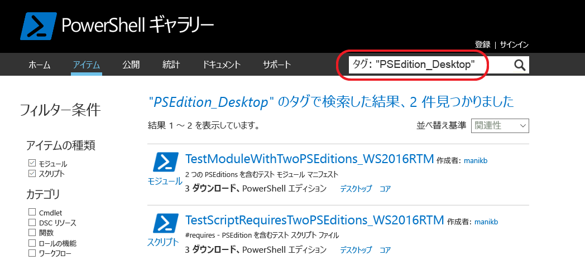

# 互換性のある PowerShell エディションが含まれるパッケージ

バージョン 5.1 から、PowerShell はさまざまな機能セットとプラットフォーム互換性を備える別のエディションで使用できます。

- **デスクトップ エディション:** .NET Framework 上に構築されており、Server Core や Windows Desktop などの Windows の完全エディションで実行する PowerShell のバージョンを対象とするスクリプトおよびモジュールとの互換性を提供します。
- **コア エディション:** .NET Core 上に構築されており、Nano Server や Windows IoT などの Windows の縮小エディションで実行する PowerShell のバージョンを対象とするスクリプトおよびモジュールとの互換性を提供します。

## PowerShell ギャラリーでサポートされている PSEditions メタデータを抽出し、特定の PowerShell エディションと互換性のあるパッケージをフィルター処理できるようにする

パッケージが指定された PSEditions と互換性がある場合、'PowerShell Editions' の一部としてパッケージの表示ページ、およびパッケージ結果に表示されます。

## PowerShellCore で機能するギャラリー UI のパッケージを検索する

Tags:"PSEdition_Desktop" と Tags:"PSEdition_Core" を使用して PowerShell ギャラリー上のパッケージをフィルター処理します。

### Tags:"PSEdition_Core" を使用して PowerShell Core エディションと互換性のある項目を検索します。

### Tags:"PSEdition_Desktop" を使用して PowerShell Desktop エディションと互換性のある項目を検索します。

## 互換性のある PowerShell エディションが含まれるパッケージの作成と検索に関する詳細

- [PSEditions が含まれるモジュール](../../concepts/module-psedition-support.md)
- [PSEditions のスクリプト](../../concepts/script-psedition-support.md)
