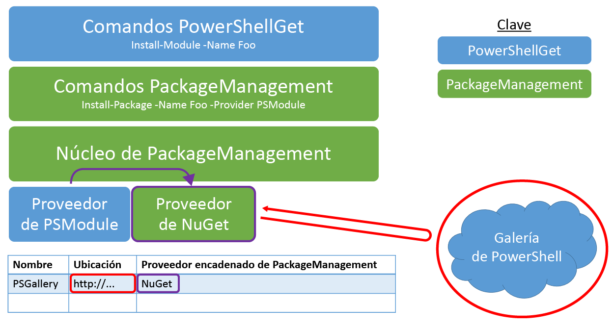

# AppLocker: Frequently Asked Questions (AppLocker: よく寄せられる質問)

## PowerShell モジュールとは何ですか。

PowerShell モジュールは、いくつかの PowerShell 機能を含む再利用可能なパッケージです。 PowerShell のすべてのもの (関数、変数、DSC リソースなど) がモジュールでパッケージ化されます。 通常、モジュールとは、特定のパス上に保存される、特定の種類のファイルを含むフォルダーです。 PowerShell モジュールには、いくつかの種類があります。

## PowerShell スクリプトとは何ですか。

PowerShell スクリプトとは、再利用と共有を可能にするため、.ps1 ファイルに保存される一連のコマンドです。 PowerShell ワークフローは PowerShell スクリプトでもあり、一連のタスクとそのタスクの順序の概要を示します。 詳細については、「[PowerShell ファースト ステップ ガイド](https://technet.microsoft.com/en-us/library/jj134242.aspx)」を参照してください。

## PowerShell スクリプトと PowerShell モジュールの違いは何ですか。

モジュールは一般に共有に適していますが、ワークフローとスクリプトのコミュニティへの投稿を容易にするため、スクリプト共有を有効にしています。 詳細については、次のブログを参照してください。

- [Don't Write Scripts, Write PowerShell Modules (スクリプトではなく、PowerShell モジュールを記述しよう)](http://blogs.technet.com/b/heyscriptingguy/archive/2011/06/27/don-t-write-scripts-write-powershell-modules.aspx)
- [Understanding PowerShell Modules (PowerShell モジュールの概要)](http://blogs.technet.com/b/heyscriptingguy/archive/2015/07/10/understanding-powershell-modules.aspx)

## どのようにして PowerShell ギャラリーに公開できますか。

項目を PowerShell ギャラリーに公開するには、ギャラリーにアカウントを登録する必要があります。 これは、登録時に提供される NuGetApiKey が項目の公開に必要になるためです。 登録するには、個人、職場、または学校のアカウントを使用して PowerShell ギャラリーにサインインします。 初めてサインインするときは、1 回限りの登録処理が必要です。 その後、NuGetApiKey キーをプロファイル ページで使用できるようになります。

ギャラリーに登録したら、[Publish-Module](http://go.microsoft.com/fwlink/?LinkID=760387&clcid=0x409) または [Publish-Script](http://go.microsoft.com/fwlink/?LinkID=760387&clcid=0x409) コマンドレットを使用して項目をギャラリーに公開します。 これらのコマンドレットを実行する方法の詳細については、[公開] タブにアクセスするか、[Publish-Module](http://go.microsoft.com/fwlink/?LinkID=760387&clcid=0x409) および [Publish-Script](http://go.microsoft.com/fwlink/?LinkID=760387&clcid=0x409) のドキュメントを参照してください。

**項目をインストールまたは保存する場合は、ギャラリーに登録またはサインインする必要はありません。**

## PowerShell ギャラリーに項目を公開しようとして、"要求を処理できませんでした。 '指定した API キーが無効か、指定したパッケージへのアクセス許可がありません。' リモート サーバーがエラーを返しました: (403) 許可されていません" というエラーを受信しました。 これは何を意味しますか。

このエラーは、次の理由で発生することがあります。

- **指定された API キーが無効。**
     自分のアカウントから有効な API キーを指定したことを確認します。 API キーを取得するには、プロファイル ページを表示します。
- **指定された項目名を所有していない。**
     自分の API キーが正しいことを確認できた場合、使用しようとしているものと同じ名前の項目が既に存在すると考えられます。 項目が所有者によってリストから外されている場合は、検索結果には表示されません。 同じ名前の項目が既に存在するかどうかを確認するには、ブラウザーを開き、項目の詳細ページ: `https://www.powershellgallery.com/packages/<itemName>` に移動します。 たとえば、`https://www.powershellgallery.com/packages/pester` に直接移動すると、Pester モジュールの詳細ページが表示され、リストから外されているかどうかがわかります。 競合する項目が既に存在し、リストから外されている場合は、次のようにできます。
    - 別の項目名を選択する。
    - 既存の項目の所有者に問い合わせる。

## 昨日はサインインできましたが、個人アカウントにサインインできないのはなぜですか。

ギャラリー アカウントがプライマリ電子メールのエイリアスの変更に対応していないことに注意してください。 詳細については、「[Microsoft アカウントのエイリアスを管理する](http://windows.microsoft.com/en-us/windows/outlook/add-alias-account)」を参照してください。

## [項目] タブの [カテゴリ] チェックボックスをすべてオンにすると、ギャラリーの項目がすべて表示されなくなるのはなぜですか。

[カテゴリ] チェックボックスをオンにすることは、"このカテゴリの項目をすべて表示したい" ということを意味します。 選択したカテゴリの項目のみが表示されます。 同様に、[カテゴリ] チェックボックスをすべてオンにすることは、"任意のカテゴリの項目をすべて表示したい" ということを意味します。 ただし、ギャラリーの一部の項目は、一覧に表示されているどのカテゴリにも属さないため、結果には表示されなくなります。 ギャラリー内のすべての項目を表示するには、すべての [カテゴリ] のチェックをオフにするか、[項目] タブを再度選択します。

## モジュールを PowerShell ギャラリーに公開するための要件は何ですか。

PowerShell モジュールのどの種類 (スクリプト モジュール、バイナリ モジュール、マニフェスト モジュールなど) でも、ギャラリーに公開できます。 モジュールを公開するには、PowerShellGet がそのバージョン、説明、作成者、そのライセンス取得方法について認識している必要があります。 この情報は、*モジュール マニフェスト* (.psd1) ファイル、または[**Publish-Module**](http://go.microsoft.com/fwlink/?LinkID=760387&clcid=0x409) コマンドレットの **LicenseUri** パラメーターの値から公開プロセスの一環として読み取られます。 ギャラリーに公開されるすべてのモジュールに、モジュール マニフェストが必要です。 マニフェストに次の情報を含むモジュールはすべて、ギャラリーに公開できます。

- バージョン
- 説明
- 作成者
- マニフェストの **PrivateData** セクションの一部として、または [**Publish-Module**](http://go.microsoft.com/fwlink/?LinkID=760387&clcid=0x409)コマンドレットの **LicenseUri** パラメーターの、モジュールのライセンス条項への URI。

## 正しい形式のモジュール マニフェストはどのように作成できますか。

モジュール マニフェストを作成するもっとも簡単な方法は、[**New-ModuleManifest**](http://go.microsoft.com/fwlink/?LinkID=760387&clcid=0x409) コマンドレットを実行することです。 PowerShell 5.0 以降、New-ModuleManifest によって、**ProjectUri**、**LicenseUri**、**Tags** などの有用なメタデータのフィールドが空白のまま、正しい形式のマニフェストが生成されるようになりました。 空白を埋めるか、正しい形式のサンプルとして生成されたマニフェストを使用します。

必要なメタデータ フィールドがすべて正しく入力されているかどうかを確認するには、[**Test-ModuleManifest**](http://go.microsoft.com/fwlink/?LinkID=760387&clcid=0x409) コマンドレットを使用します。

モジュール マニフェスト ファイルのフィールドを更新するには、[**Update-ModuleManifest**](http://go.microsoft.com/fwlink/?LinkID=760387&clcid=0x409) コマンドレットを使用します。

## スクリプトをギャラリーに公開するための要件は何ですか。

PowerShell スクリプトのどの種類 (スクリプトまたはワークフロー) でも、ギャラリーに公開できます。 スクリプトを公開するには、PowerShellGet がそのバージョン、説明、作成者、そのライセンス取得方法について認識している必要があります。 この情報は、スクリプト ファイルの *PSScriptInfo* セクション、または[**Publish-Script**](http://go.microsoft.com/fwlink/?LinkID=760387&clcid=0x409) コマンドレットの **LicenseUri** パラメーターの値から公開プロセスの一環として読み取られます。 ギャラリーに公開されるすべてのスクリプトに、メタデータ情報が必要です。 PSScriptInfo セクションに次の情報を含むスクリプトはすべて、ギャラリーに公開できます。

- バージョン
- 説明
- 作成者
- スクリプトの **PSScriptInfo** セクションの一部として、または [**Publish-Script**](http://go.microsoft.com/fwlink/?LinkID=760387&clcid=0x409) コマンドレットの **LicenseUri** パラメーターの、スクリプトのライセンス条項への URI。

## どのように検索しますか。

検索したいものをテキスト ボックスに入力します。 たとえば、Azure SQL に関連するモジュールを検索する場合は、「azure sql」と入力します。 検索エンジンが、タイトル、説明、全体のメタデータを含め、公開されているすべての項目からこれらのキーワードを検索します。 次に、重み付けされた品質スコアに基づき、もっとも近い一致が表示されます。 また、次のフィールドについて、検索クエリで field:"value" 構文を使用して、特定のフィールドを検索することもできます。

- タグ
- 関数
- コマンドレット
- DscResources
- PowerShellVersion

たとえば、PowerShellVersion:"2.0" と検索すると、PowerShellVersion 2.0 (モジュール/スクリプト マニフェストに基づく) に対応する結果のみが表示されます。

## 正しい形式のスクリプト ファイルはどのように作成できますか。

正しい形式でスクリプト ファイルを作成するもっとも簡単な方法は、[**New-ScriptFileInfo**](http://go.microsoft.com/fwlink/?LinkID=760387&clcid=0x409) コマンドレットを実行することです。 PowerShell 5.0 以降、New-ScriptFileInfo によって、**ProjectUri**、**LicenseUri**、**Tags** などの有用なメタデータのフィールドが空白のまま、正しい形式のスクリプト ファイルが生成されるようになりました。 空白を埋めるか、正しい形式のサンプルとして生成されたスクリプト ファイルを使用します。

必要なメタデータ フィールドがすべて正しく入力されているかどうかを確認するには、[**Test-ScriptFileInfo**](http://go.microsoft.com/fwlink/?LinkID=760387&clcid=0x409) コマンドレットを使用します。

スクリプト メタデータ フィールドを更新するには、[**Update-ScriptFileInfo**](http://go.microsoft.com/fwlink/?LinkID=760387&clcid=0x409) コマンドレットを使用します。

## その他にどのような PowerShell モジュールがありますか。

PowerShell モジュールという用語は、実際の機能を実装するファイルも意味します。 スクリプト モジュール ファイル (.psm1) には PowerShell コードが含まれます。 バイナリ モジュール ファイル (.dll) にはコンパイルされたコードが含まれます。

ここでは、1 つの考え方があります。モジュールをカプセル化したフォルダーは、モジュール フォルダーです。 モジュール フォルダーには、フォルダーの内容を説明するモジュール マニフェスト (.psd1) が含まれることがあります。 実際に機能するファイルはスクリプト モジュール ファイル (.psm1) とバイナリ モジュール ファイル (.dll) です。 DSC リソースは特定のサブフォルダーにあり、スクリプト モジュール ファイルまたはバイナリ モジュール ファイルとして実装されます。

ギャラリー内のモジュールにはすべてモジュール マニフェストが含まれ、これらのモジュールの大部分にスクリプト モジュール ファイルまたはバイナリ モジュール ファイルが含まれています。 モジュールという用語は、このような意味の違いから混乱することがあります。 とくに明示しない限り、このページで使用するモジュールという用語は、このようなファイルを含むモジュール フォルダーを意味しています。

## PackageManagement は PowerShellGet にどのように関連しているでしょうか。 (大まかな回答)

PackageManagement はどのパッケージ マネージャーでも機能する一般的なインターフェイスです。 最終的には、PowerShell モジュール、MSI、Ruby gem、NuGet パッケージ、Perl モジュールのどれを扱っていても、その検索とインストールには、PackageManagement のコマンド(Find-Package および Install-Package) を使用できる必要があります。 PackageManagement では、PackageManagement に差し込まれるそれぞれのパッケージ マネージャーのパッケージ プロバイダーを指定することによってこれを実行します。 プロバイダーは、実際の作業をすべて行います。リポジトリからコンテンツをフェッチし、そのコンテンツをローカルにインストールします。 多くの場合、パッケージ プロバイダーは、指定したパッケージの種類の既存のパッケージ マネージャー ツールを単にラップするだけです。

PowerShellGet は PowerShell 項目のパッケージ マネージャーです。 PackageManagement を介して PowerShellGet 機能を公開する PSModule パッケージ プロバイダーがあります。 このため、[Install-Module](http://go.microsoft.com/fwlink/?LinkID=760387&clcid=0x409) または Install-Package -Provider PSModule を実行して、PowerShell ギャラリーからモジュールをインストールすることができます。 [Update-Module](http://go.microsoft.com/fwlink/?LinkID=760387&clcid=0x409) および [Publish-Module](http://go.microsoft.com/fwlink/?LinkID=760387&clcid=0x409) を含む特定の PowerShellGet 機能には、PackageManagement コマンドではアクセスできません。

つまり、PowerShellGet はPowerShell コンテンツのプレミアム パッケージ管理エクスペリエンスにのみ重点を置いています。 PackageManagement は、単一の一般的なツール セットによるすべてのパッケージ管理エクスペリエンスの公開に重点を置いています。 この回答では不十分な場合は、このドキュメントの下部にある「**PackageManagement は実際に PowerShellGet にどのように関連しているでしょうか。**」のセクションに詳しい回答があります。

詳細については、[PackageManagement プロジェクトのページ](http://oneget.org/)にアクセスしてください。

## NuGet は PowerShellGet にどのように関連しているでしょうか。

PowerShell ギャラリーは、[NuGet ギャラリー](http://www.nuget.org/)に変更を加えたバージョンです。 PowerShellGet は、NuGet プロバイダーを使用して、PowerShell ギャラリーなどの NuGet ベースのリポジトリで機能します。

PowerShellGet は任意の有効な NuGet リポジトリまたはファイル共有に対して使用することができます。 単に [**Register-PSRepository**](http://go.microsoft.com/fwlink/?LinkID=760387&clcid=0x409) コマンドレットを実行して、リポジトリを追加する必要があります。

## NuGet.exe をギャラリーで使用できるという意味でしょうか。

対応

## PackageManagement は実際に PowerShellGet にどのように関連しているでしょうか。 (技術的な詳細)

内部的に、PowerShellGet は PackageManagement インフラストラクチャを大きく活用しています。

PowerShell コマンドレット層で、[Install-Module](http://go.microsoft.com/fwlink/?LinkID=760387&clcid=0x409) は実際には Install-Package -Provider PSModule の Thin ラッパーです。

PackageManagement パッケージ プロバイダー層では、PSModule パッケージ プロバイダーは実際に他の PackageManagement パッケージ プロバイダーを呼び出します。 たとえば、NuGet ベースのギャラリー (PowerShell ギャラリーなど) を使用している場合、PSModule パッケージ プロバイダーでは、リポジトリで使用できるように NuGet パッケージ プロバイダーを使用します。

図 1: PowerShellGet アーキテクチャ

## PowerShellGet を実行するには何が必要ですか。

一般的には、PowerShellGet モジュールの最新バージョンを選択することをお勧めします (これには .NET 4.5 が必要です)。

**PowerShellGet** モジュールは **PowerShell 3.0 以降**を必要とします。

そのため、**PowerShellGet** は次のいずれかのオペレーティング システムを必要とします。

- Windows 10
- Windows 8.1 Pro
- Windows 8.1 Enterprise
- Windows 7 SP1
- Windows Server 2016
- Windows Server 2012 R2
- Windows Server 2008 R2 SP1

**PowerShellGet** には、.NET Framework 4.5 以降も必要です。 .NET Framework 4.5 以降を[ここ](https://msdn.microsoft.com/en-us/library/5a4x27ek.aspx)からインストールできます。

## 将来的に公開される項目の名前を予約することはできますか。

項目名をとっておくことはできません。 既存の項目より、その名前が自分の項目に適していると思われる場合は、[項目の所有者に問い合わせてみてください](psgallery_contacting_item_owners.md)。 2、3 週間連絡がない場合は、サポートに連絡いただければ PowerShell Gallery チームが調査にあたります。

## 項目の所有権はどのように主張できますか。

詳細については、「[PowerShellGallery.com で項目の所有者を管理する](Managing-Item-Owners.md)」を参照してください。

## 自分の項目ライセンスを侵害している項目所有者にはどう対処しますか。

その項目所有者とその他の項目所有者の間で生じる論争については、PowerShell コミュニティでの解決をお勧めします。  [争いの解決プロセス](psgallery_dispute_resolution.md)を用意しておりますので、PowerShellGallery.com の管理者が仲裁に入る前に確認してください。

<!--HONumber=Oct16_HO2-->

