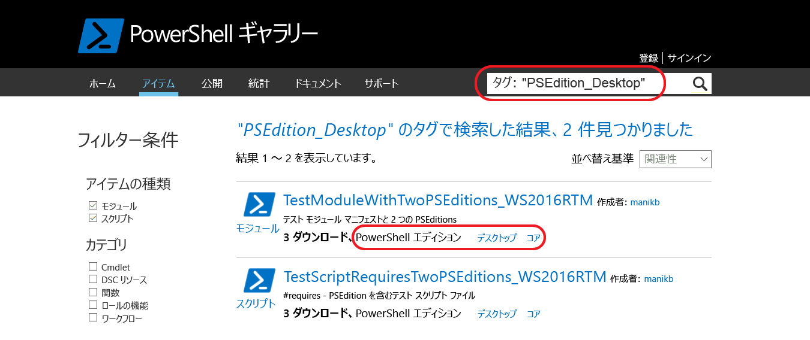

# 互換性のある PowerShell エディションが含まれる項目
バージョン 5.1 から、PowerShell はさまざまな機能セットとプラットフォーム互換性を備える別のエディションで使用できます。

- **デスクトップ エディション:** .NET Framework 上に構築されており、Server Core や Windows Desktop などの Windows の完全エディションで実行する PowerShell のバージョンを対象とするスクリプトおよびモジュールとの互換性を提供します。
- **コア エディション:** .NET Core 上に構築されており、Nano Server や Windows IoT などの Windows の縮小エディションで実行する PowerShell のバージョンを対象とするスクリプトおよびモジュールとの互換性を提供します。

## PowerShell ギャラリーは、サポートされている PSEditions メタデータを抽出するため、特定のPowerShell のエディションと互換性のある項目をフィルター処理できます。

項目が指定した PSEditions と互換性がある場合、'PowerShell Editions' の一部として項目の表示ページ、および項目結果に表示されます。

## PowerShellCore で機能するギャラリー UI の項目を検索します。
Tags:"PSEdition_Desktop" と Tags:"PSEdition_Core" を使用して PowerShell ギャラリー上の項目をフィルター処理します。

### Tags:"PSEdition_Core" を使用して PowerShell Core エディションと互換性のある項目を検索します。

### Tags:"PSEdition_Desktop" を使用して PowerShell Desktop エディションと互換性のある項目を検索します。

## 互換性のある PowerShell エディションが含まれる項目の作成と検索に関する詳細
### [PSEditions が含まれるモジュール](../psget/module/modulewithpseditionsupport.md)
### [PSEditions のスクリプト](../psget/script/scriptwithpseditionsupport.md)

<!--HONumber=Oct16_HO2-->

