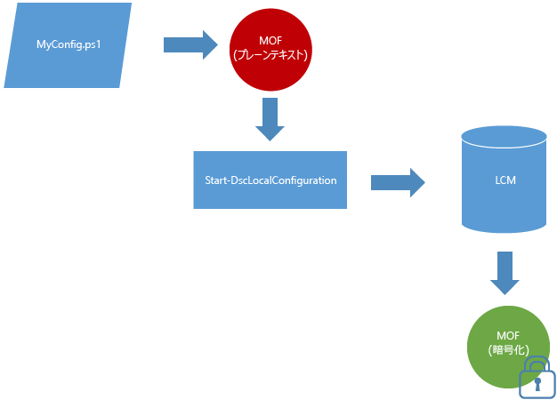

# MOF ドキュメントは既定で暗号化されます

構成ドキュメントには、機密情報が含まれます。 以前のバージョンの DSC では、構成内の資格情報を保護するために、証明書を配布し、管理する必要がありました。 多くの場合、これは管理上大きな負担となり、多くの作業を行ったとしても、一部の構成情報が保護されないままでした。

**すべての構成 MOF が既定で保護されている**ため、この問題は解決されました。 証明書またはメタ構成の設定は必要ありません。 構成 MOF がターゲット ノードのローカル構成マネージャー (LCM) によってディスクに保存されるときには必ず暗号化されます。 MOF は、[DPAPI](https://msdn.microsoft.com/library/ms995355.aspx) を使用して暗号化されます。 **注:** 構成スクリプトによって生成された MOF は暗号化されません。

**例:** プッシュ モードの暗号化 

パスワードの暗号化に証明書メソッドを既に使用している場合、またはパスワードのセキュリティを強化する必要がある場合は、[証明書ベースの暗号化の既存のメソッド](https://msdn.microsoft.com/powershell/dsc/securemof)が引き続き機能します。 結果として、DPAPI を使用して MOF ドキュメントが完全に暗号化され、ドキュメント内でパスワードが暗号化されます。

この暗号化は、構成 MOF ドキュメント (pending.mof、current.mof、previous.mof、および部分的な MOF) にのみ適用されます。 シークレットが含まれる可能性が低いため、メタ構成 MOF は引き続きプレーン テキストに保存されます。
