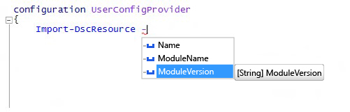

<a id="import-dscresource-keyword-supports--moduleversion-parameter" class="xliff"></a>

# -ModuleVersion パラメーターをサポートする Import-DscResource キーワード

DSC 構成を作成するときに使用できる、`Import-DscResource` dynamic キーワードに新しいパラメーターを追加しました。 構成の作成者は、どのモジュール バージョンから DSC リソースを読み込むかを正確に指定できます。 キーワードの新しい構文は次の通りです:

```powershell
Import-DscResource [-Name <ResourceName(s)>] [-ModuleName <ModuleName(s)>] [-ModuleVersion <ModuleVersion>]
```

* **Name**: インポートする 1 つまたは複数のリソースの名前。
* **ModuleName**: モジュール名、またはインポートする 1 つまたは複数のモジュールの ModuleSpecification オブジェクト。
* **ModuleVersion**: インポートするモジュールのバージョン。 ModuleName が使用される場合、1 つの名前で 1 つのモジュールのみを表す必要があります。 

Windows PowerShell ISE では、IntelliSense と共に表示されます。



**注**: `–ModuleVersion` パラメーターは `–ModuleName` パラメーターと組み合わせてのみ使用できます。 `–Name` パラメーターのみを使用したリソース名では、使用できません。

これまでは、DSC リソースを読み込むときに、モジュールのバージョンを指定する唯一の方法は、`–ModuleName @{ModuleName="UserConfigProvider";ModuleVersion="3.0"}` などのモジュール指定オブジェクトを使用する方法のみでした。

