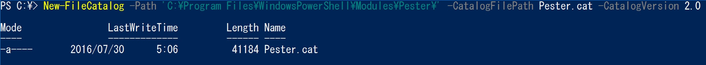
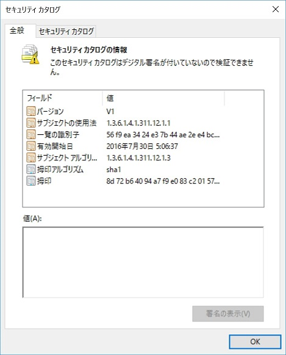
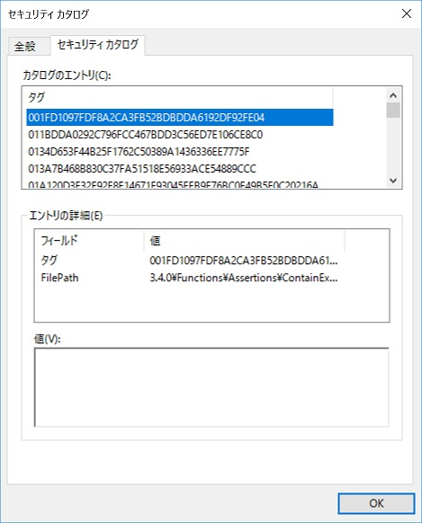
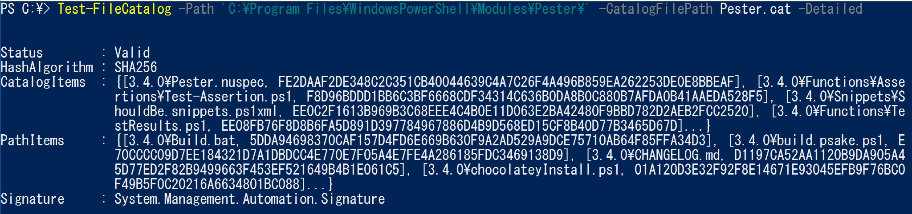

<a id="catalog-cmdlets" class="xliff"></a>

# カタログ コマンドレット  

[Microsoft.Powershell.Secuity](https://technet.microsoft.com/en-us/library/hh847877.aspx) モジュールに新しいコマンドレットが 2 つ追加されました。Windows カタログ ファイルを生成し、検証するコマンドレットです。  

<a id="new-filecatalog" class="xliff"></a>

## New-FileCatalog 
--------------------------------

`New-FileCatalog` は、一連のフォルダーやファイルに対して Windows カタログ ファイルを作成します。 カタログ ファイルには、指定されたパスのすべてのファイルのハッシュが含まれています。 ユーザーは一連のフォルダーと共に、それらのフォルダーを表すカタログ ファイルを配信できます。 コンテンツの受信側は、カタログ ファイルを使用して、カタログが作成された後にフォルダーに変更が行われたかどうかを検証することができます。    

```PowerShell
New-FileCatalog [-CatalogFilePath] <string> [[-Path] <string[]>] [-CatalogVersion <int>] [-WhatIf] [-Confirm] [<CommonParameters>]
```
カタログのバージョン 1 と 2 を作成できます。 バージョン 1 は SHA1 ハッシュ アルゴリズムを使用して、バージョン 2 は SHA256 ハッシュ アルゴリズムを使用してファイル ハッシュを作成します。 *Windows Server 2008 R2* と *Windows 7* はカタログ バージョン 2 に対応していません。 プラットフォームとして *Windows 8*、*Windows Server 2012* 以降を使用する場合、カタログ バージョン 2 が推奨されます。  

既存のモジュールでこのコマンドを使用するには、モジュール マニフェストの場所と一致するように CatalogFilePath および Path 変数を指定します。 下の例では、モジュール マニフェストは、C:\Program Files\Windows PowerShell\Modules\Pester にあります。 



これはカタログ ファイルを作成します。 

  

 

カタログ ファイルの整合性を検証するために (上記の例では Pester.cat)、[Set-AuthenticodeSignature](https://technet.microsoft.com/library/hh849819.aspx) コマンドレットで署名する必要があります。   


<a id="test-filecatalog" class="xliff"></a>

## Test-FileCatalog 
--------------------------------

`Test-FileCatalog` は、一連のフォルダーを表すカタログを検証します。 

```PowerShell
Test-FileCatalog [-CatalogFilePath] <string> [[-Path] <string[]>] [-Detailed] [-FilesToSkip <string[]>] [-WhatIf] [-Confirm] [<CommonParameters>]
```



このコマンドレットは、カタログ ファイル内で見つかったすべてのファイルとその相対パスのハッシュを、ディスクに保存されているものと比較します。 ファイル ハッシュとパスの間に不一致が検出された場合、`ValidationFailed` というステータスを返します。 `Detailed` スイッチを利用し、この情報をすべて取得できます。 カタログの署名ステータスは、`Signature` フィールドとして表示されます。これは、カタログ ファイルで [Get-AuthenticodeSignature](https://technet.microsoft.com/en-us/library/hh849805.aspx) コマンドレットを呼び出すことと同じです。 `FilesToSkip` パラメーターを利用し、検証中にファイルをスキップすることもできます。 

