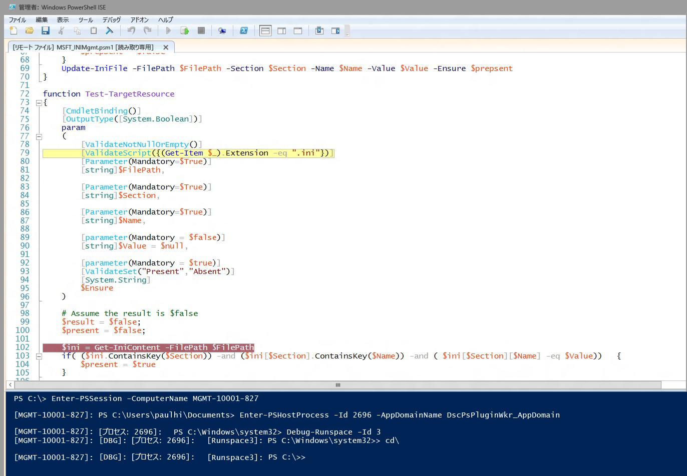

# DSC リソース スクリプトのデバッグ
WMF 5.0 Production Preview には、ターゲット ノードで実行中に DSC リソース スクリプトをデバッグするためのサポートが含まれています。 以前の WMF 5.0 リリースでは、高度なスクリプト デバッグ機能として、ローカル プロセスにアタッチする機能 (Get-PSHostProcessInfo、Enter-PSHostProcessInfo、Exit-PSHostProcessInfo)、プロセス内のすべての実行空間を列挙する機能、およびプロセス内の任意の実行空間をデバッグする機能 (Get-Runspace、Debug-Runspace) が追加されました。

DSC リソース スクリプトのデバッグでは、この機能を土台にして、さらに 2 つの新しいコマンドレットが追加されました。

##構文
**Enable-DscDebug**
Enable-DscDebug \[-BreakAll\] \[-CimSession &lt;CimSession\[\]&gt;\] \[-ThrottleLimit &lt;int&gt;\] \[-AsJob\] \[-WhatIf\] \[-Confirm\] \[&lt;CommonParameters&gt;\]

**Disable-DscDebug**
Disable-DscDebug \[-CimSession &lt;CimSession\[\]&gt;\] \[-ThrottleLimit &lt;int&gt;\] \[-AsJob\] \[-WhatIf\] \[-Confirm\] \[&lt;CommonParameters&gt;\]

##典型的なワークフロー


```PowerShell
PS C:\Test> Enable-DscDebug –BreakAll

PS C:\Test> Start-DscConfiguration -path .\TestConfig2 -Wait -Verbose
VERBOSE: Perform operation 'Invoke CimMethod' with following parameters, ''namespaceName' = root/Microsoft/Windows/DesiredStateConfiguration,'className' = MSFT\_DSCLocalConfigurationManager,'methodName' = SendConfigurationApply'.
VERBOSE: An LCM method call arrived from computer MGMT-10001-827 with user sid S-1-5-21-397955417-626881126-188441444-3860663.
VERBOSE: [MGMT-10001-827]: LCM: [ Start Set ]
WARNING: [MGMT-10001-827]: [DSCEngine] Warning LCM is in Debug 'ResourceScriptBreakAll' mode. Resource script processing will be stopped to wait for PowerShell script debugger to attach.
VERBOSE: [MGMT-10001-827]: [DSCEngine] Importing the module C:\WINDOWS\system32\WindowsPowerShell\v1.0\Modules\PSDesiredStateConfiguration\DscResources\MSFT_EnvironmentResource\MSFT_EnvironmentResource.psm1 in force mode.
VERBOSE: [MGMT-10001-827]: LCM: [ Start Resource ] [[Environment]e1]
VERBOSE: [MGMT-10001-827]: LCM: [ Start Test ] [[Environment]e1]
VERBOSE: [MGMT-10001-827]: [[Environment]e1] Importing the module MSFT_EnvironmentResource in force mode.
WARNING: [MGMT-10001-827]: [[Environment]e1] Resource is waiting for PowerShell script debugger to attach. Use the following commands to begin debugging this resource script:
Enter-PSSession -ComputerName MGMT-10001-827 -Credential <credentials>
Enter-PSHostProcess -Id 2640 -AppDomainName DscPsPluginWkr_AppDomain
Debug-Runspace -Id 3

PS C:\Test> Disable-DscDebug
```
これらの各コマンドとその実行内容を見ていきましょう。

**Enable-DscDebug –BreakAll**
BreakAll を指定した Enable-DscDebug コマンドレットでは、Get-TargetResource、Set-TargetResource、および Test-TargetResource の各スクリプトを [すべて中断] モードで実行するように DSC LCM を構成します。 このモードでは、スクリプトはスクリプトの最初のステートメントで停止し、デバッガーがアタッチされるまで待機します。 その後、Windows PowerShell リモート処理を使ってターゲット コンピューターに接続し、スクリプトをデバッグするための LCM プロセスと実行空間に Windows PowerShell デバッガーをアタッチします。 その後は、Windows PowerShell の通常の方法でブレークポイントを設定し、スクリプトをデバッグできます。

**Start-DscConfiguration -path .\TestConfig2 -Wait -Verbose**

これにより、DSC が開始します。ただし、ターゲット ノードはデバッグ モードになっているため、前に説明したとおり、LCM が実行する最初の DSC リソースの位置で停止します。

デバッグ セッションを開始するには、Start-DscConfiguration を実行した後の警告メッセージに示されているコマンドを実行することにより、該当するコンピューター、プロセス、アプリケーション ドメイン、および実行空間に、クライアントの Windows PowerShell スクリプト デバッガーをアタッチします。

* このコマンドは、Windows PowerShell リモート処理を使って対象のコンピューターに接続するために、必要に応じて実行します。 既にリモート デスクトップ接続がある場合は、この手順をスキップします。
```PowerShell
Enter-PSSession -ComputerName MGMT-10001-827
```
* このコマンドでは、リソースのスクリプトが実行されている DSC LCM ホスト プロセスおよびアプリ ドメインにアタッチします。
```PowerShell
Enter-PSHostProcess -Id 2640 -AppDomainName DscPsPluginWkr\_AppDomain
```
*  この最後のコマンドにより、スクリプトを実行している DSC 実行空間をデバッグできるようになります。
```PowerShell
Debug-Runspace -Id 3
```


デバッガーをアタッチした後は、スクリプトの実行を調査する行にブレークポイントを設定し、**continue** デバッガー コマンドを実行して、スクリプトをデバッガー内で実行します。 デバッグが終了したら、**quit** デバッガー コマンドを入力すれば、スクリプトの実行を停止できます。または、**detach** デバッガー コマンドを実行すれば、デバッガーなしでスクリプトの実行を続行できます。

デバッガーでは、***すべての***リソース スクリプトが停止することに注意してください。 これは、デバッガーでは Test-TargetResoruce、Set-TargetResource、および Get-TargetResource スクリプトがそれぞれ順番に停止することを意味します。 リソース スクリプトをデバッグする必要がない場合は、次のコマンドを実行すれば、実行空間でのデバッグ モードを終了できます。

Disable-RunspaceDebug -RunspaceId 3

または、Debug-Runspace を実行してデバッガーをアタッチした後、すぐに **detach** コマンドを実行することもできます。

リソース スクリプトのデバッグが完了したら、次のコマンドを実行して、DSC 構成を停止する必要があります。

Stop-DscConfiguration –Force

最後に、Disable-DscDebug コマンドレットを使って、デバッグ モードを無効にするように対象のコンピューターの LCM を再構成する必要があります.<!--HONumber=Mar16_HO2-->
